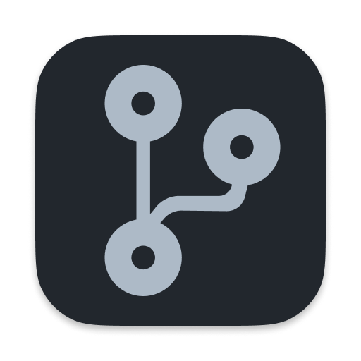

     
  <a href="https://github.com/pulls">github.com/pulls</a>, directly from your MacOS menubar, with some extras

# pulls

A menubar application for managing pull requests, similar to what <a href="https://github.com/pulls">github.com/pulls</a> provides, but with a few added extras:

- Custom pre-defined queries for the data you care about (supports anything that github's search syntax supports)
- Folders for organizing in progress work

## Usage

Hotkeys:

| Combo                               | Action                           |
| ----------------------------------- | -------------------------------- |
| `Cmd+G`                             | Group Selected PRs               |
| `Cmd+O`                             | Open Selected PRs in Browser     |
